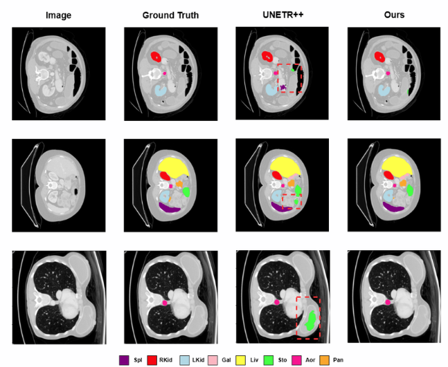
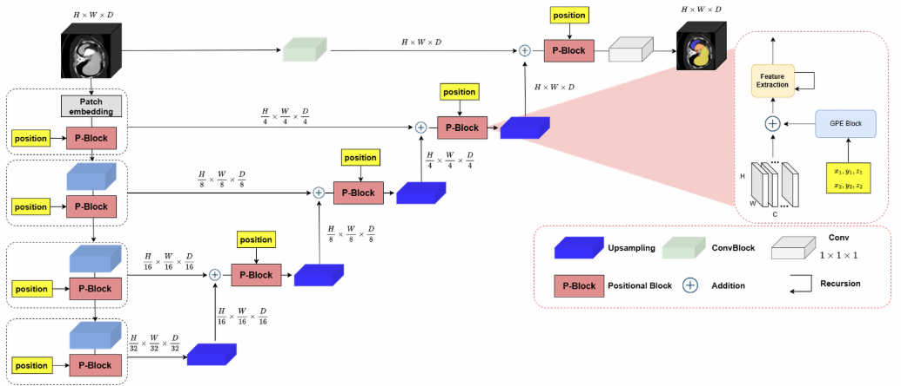
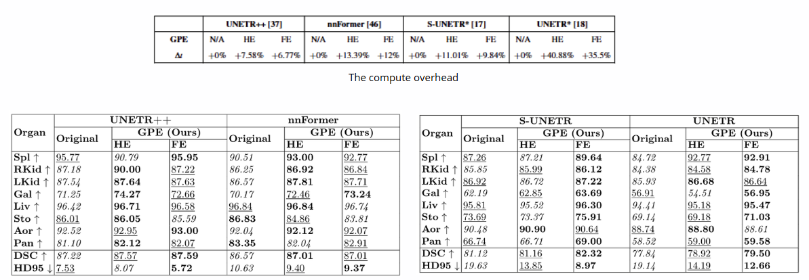

# Global Positional Encoding and Its Application in Medical Image Segmentation
[](https://link.springer.com/chapter/10.1007/978-981-95-4960-3_36)
[](https://www.canva.com/design/DAG6RupacLw/tIKvDYx15oeFsrdTp5l_4Q/edit?utm_content=DAG6RupacLw&utm_campaign=designshare&utm_medium=link2&utm_source=sharebutton)


## News
* **(Dec 28, 2025):** P_Network training and evaluation codes are released.

<hr />


> **Abstract:** *Transformer-based models have become increasingly popular for medical image segmentation. While they incorporate positional encoding to model spatial structure, this encoding only captures patch positions within a cropped 3D subvolume, not within the full anatomical scan. As a result, important global spatial context—such as organ location priors—is lost. This limitation is particularly harmful in medical scenarios where multiple organs may share similar intensity profiles but differ in anatomical position.
In this work, we propose a lightweight Global Positional Encoding (GPE) module that injects absolute 3D spatial coordinates into transformer based segmentation networks. GPE recovers lost anatomical information and enhances spatial awareness without significant overhead. We integrate GPE into four representative models—UNETR, Swin-UNETR, nnFormer, and UNETR++ and evaluate on the Synapse multi-organ CT dataset. Results show consistent performance gains across all models, with up to 1.66% improvement in Dice score and substantial reduction
in HD95.
These findings demonstrate that GPE effectively bridges the gap between local processing and global spatial reasoning, offering a simple yet powerful enhancement for medical segmentation networks.* 
<hr />


## Architecture overview of P_network
Architecture of the proposed P-Network. Each encoder/decoder stage includes a P-block, which integrates a Global Positional Encoding (GPE) module into the feature extraction process. The GPE module maps the 3D patch location into a high-dimensional embedding using hash or frequency encoding, followed by channel adaptation. 
One of the key strengths of the P-Network design is its architectural modularity. The proposed P-block is designed to seamlessly replace the feature extraction block in a wide range of existing encoder-decoder segmentation architectures without requiring any change to the overall macro-structure or training pipeline.


<hr />


## Results

### Synapse Dataset
State-of-the-art comparison on the abdominal multi-organ Synapse dataset. We report both the segmentation performance (DSC, HD95) and model complexity (parameters and FLOPs). Moreover, we also report compute and memory overhead of GPE module.
Our proposed P_network achieves favorable segmentation performance against existing methods, while considerably reducing the model complexity. Best results are in bold. 
Abbreviations stand for: Spl: _spleen_, RKid: _right kidney_, LKid: _left kidney_, Gal: _gallbladder_, Liv: _liver_, Sto: _stomach_, Aor: _aorta_, Pan: _pancreas_. 
Best results are in bold.



<hr />

## Installation
The code is tested with PyTorch 1.11.0 and CUDA 11.3. After cloning the repository, follow the below steps for installation,

1. Create and activate conda environment
```shell
conda create --name p_network python=3.8
conda activate p_network
```
2. Install PyTorch and torchvision
```shell
pip install torch==1.11.0+cu113 torchvision==0.12.0+cu113 --extra-index-url https://download.pytorch.org/whl/cu113
```
3. Install other dependencies
```shell
pip install -r requirements.txt
```

To enable hash encoding, please following the instruction from: [Instant NGP](https://docs.nerf.studio/nerfology/methods/instant_ngp.html)
<hr />


## Dataset
We follow the same dataset preprocessing as in [nnFormer](https://github.com/282857341/nnFormer). We conducted extensive experiments on Synapse. 

The dataset folders for Synapse should be organized as follows: 

```
./DATASET_Synapse/
  ├── unetr_pp_raw/
      ├── unetr_pp_raw_data/
           ├── Task02_Synapse/
              ├── imagesTr/
              ├── imagesTs/
              ├── labelsTr/
              ├── labelsTs/
              ├── dataset.json
           ├── Task002_Synapse
       ├── unetr_pp_cropped_data/
           ├── Task002_Synapse
 ```

## Training
```shell
bash run_training_synapse.sh
```

<hr />

## Reproduce
Because all the weights are in remote server, which I do not have access recently. Hence, to reproduce, please re-train the network with the provided random seed. The result should be the same.

<hr />

## Acknowledgement
This repository is (heavily) built based on [UNETR++](https://github.com/Amshaker/unetr_plus_plus/tree/main) repository.
We acknowledge Ho Chi Minh City University of Technology (HCMUT), VNU
HCM for supporting this study; and we also acknowledge Data Science Labo
ratory (DsciLab) and High Performance Computing Laboratory (HPCLab), Ho
Chi Minh City University of Technology (HCMUT) for supporting machines in
experiments.

## Citation
If you use our work, please consider citing:
```bibtex
@InProceedings{10.1007/978-981-95-4960-3_36,
author="Le, Minh-Quy
and Le, Thanh-Sach",
editor="Quan, Thanh Tho
and Sombattheera, Chattrakul
and Pham, Hoang-Anh
and Tran, Ngoc Thinh",
title="Global Positional Encoding and Its Application in Medical Image Segmentation",
booktitle="Multi-disciplinary Trends in Artificial Intelligence",
year="2026",
publisher="Springer Nature Singapore",
address="Singapore",
pages="448--459",
abstract="Transformer-based models have become increasingly popular for medical image segmentation. While they incorporate positional encoding to model spatial structure, this encoding only captures patch positions within a cropped 3D subvolume, not within the full anatomical scan. As a result, important global spatial context--such as organ location priors--is lost. This limitation is particularly harmful in medical scenarios where multiple organs may share similar intensity profiles but differ in anatomical position.",
isbn="978-981-95-4960-3"
}

```
